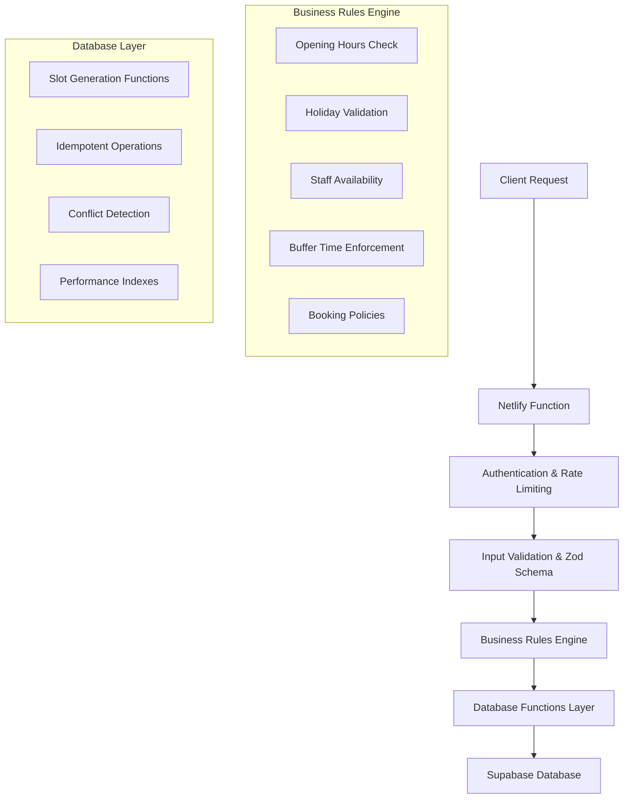
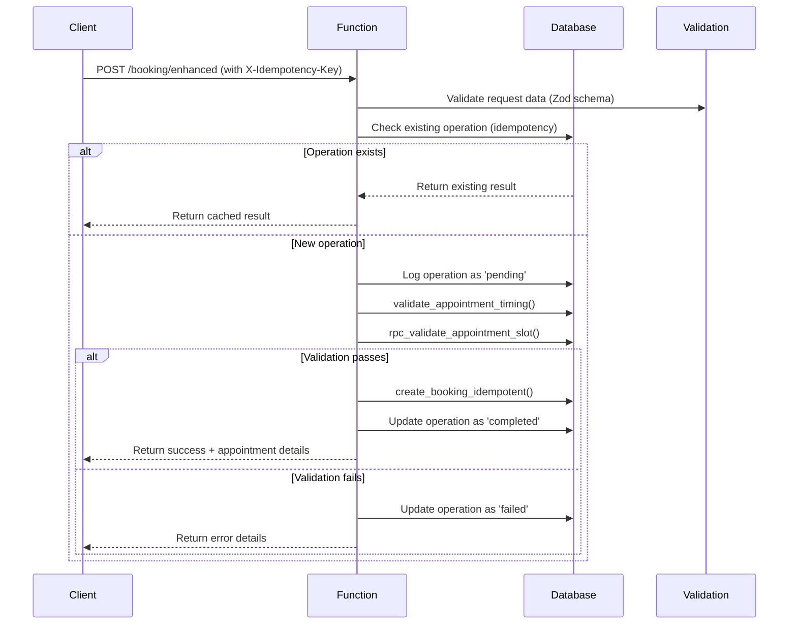
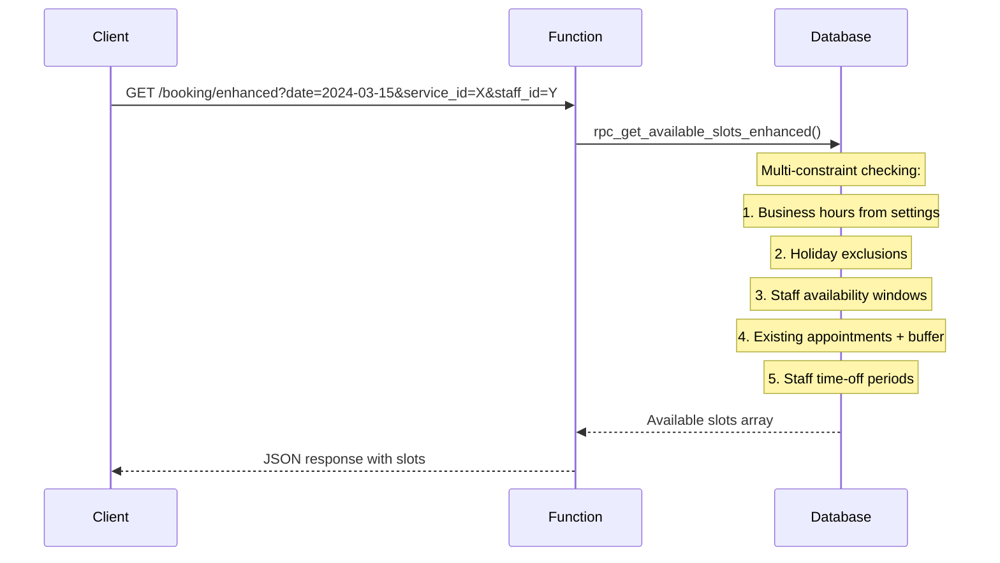

# Booking Engine & Availability Hardening - Implementation Documentation

## Overview

This document describes the comprehensive booking engine and availability hardening system implemented for Schnittwerk Your Style. The system provides robust, production-ready booking functionality with race condition prevention, comprehensive business rule validation, and optimal performance.

## Architecture Overview



## Data Flow

### 1. Booking Creation Flow



### 2. Slot Generation Flow



## Key Components

### 1. Database Enhancements

#### New Tables

**holidays**
- Manages public holidays and blackout dates
- Supports recurring holidays (e.g., Christmas every year)
- Configurable by holiday type and staff impact

**booking_policies**
- Configurable business rules
- Deadline enforcement for cancellations/reschedules
- Booking limits and constraints

**booking_operations**
- Idempotency key tracking
- Operation audit trail
- Race condition prevention

**waitlist**
- Customer waitlist management
- Priority-based queuing
- Automatic notifications on slot availability

#### Enhanced Functions

**rpc_get_available_slots_enhanced()**
```sql
-- Generates available slots considering all constraints:
-- ✓ Business hours from settings
-- ✓ Holiday exclusions
-- ✓ Staff availability windows
-- ✓ Buffer time enforcement
-- ✓ Existing appointment conflicts
-- ✓ Staff time-off periods
```

**create_booking_idempotent()**
```sql
-- Idempotent booking creation with:
-- ✓ Duplicate operation detection
-- ✓ Comprehensive validation pipeline
-- ✓ Atomic transaction handling
-- ✓ Detailed error reporting
```

**validate_appointment_timing()**
```sql
-- Business rule validation:
-- ✓ Minimum booking notice (configurable hours)
-- ✓ Maximum advance booking (configurable days)
-- ✓ Holiday exclusions
-- ✓ Business hours compliance
```

### 2. Backend Functions

#### Enhanced Booking (`/netlify/functions/booking/enhanced.ts`)

**Endpoints:**
- `GET /` - Fetch available slots with filtering
- `POST /` - Create booking with idempotency
- `GET /policies` - Check booking policies

**Features:**
- Comprehensive Zod validation
- Idempotency key enforcement
- Multi-constraint slot generation
- Detailed error reporting
- Performance optimization

#### Holiday Management (`/netlify/functions/booking/holidays.ts`)

**Endpoints:**
- `GET /` - List holidays with date range filtering
- `POST /` - Create new holiday/blackout date
- `PUT /:id` - Update existing holiday
- `DELETE /:id` - Remove holiday

**Features:**
- Recurring holiday support
- Holiday type categorization
- Staff impact configuration
- Date range queries

#### Waitlist Management (`/netlify/functions/booking/waitlist.ts`)

**Endpoints:**
- `GET /` - List waitlist entries with filtering
- `POST /` - Add customer to waitlist
- `PUT /:id` - Update waitlist entry
- `DELETE /:id` - Remove from waitlist

**Features:**
- Priority-based ordering
- Preferred time/day constraints
- Customer permission enforcement
- Status tracking

#### Reschedule/Cancel (`/netlify/functions/booking/reschedule-cancel.ts`)

**Endpoints:**
- `PUT /reschedule` - Reschedule appointment
- `PUT /cancel` - Cancel appointment

**Features:**
- Policy deadline enforcement
- Reschedule limit tracking
- Automatic waitlist notifications
- Permission-based access control

### 3. Business Rules & Policies

#### Configurable Policies

| Policy Key | Description | Default Value |
|------------|-------------|---------------|
| `cancellation_deadline_hours` | Hours before appointment cancellation allowed | 24 |
| `reschedule_deadline_hours` | Hours before appointment reschedule allowed | 2 |
| `max_reschedules` | Maximum reschedules per appointment | 3 |
| `advance_booking_limit_days` | Maximum days ahead for booking | 90 |
| `minimum_booking_notice_hours` | Minimum hours notice for booking | 2 |
| `waitlist_notification_hours` | Hours before appointment to notify waitlist | 48 |
| `double_booking_prevention` | Enable strict validation | true |

#### Business Hours Integration

The system integrates with the business settings from the previous PR:

```json
{
  "opening_hours": {
    "0": {"is_open": false, "start_time": "10:00", "end_time": "14:00"},
    "1": {"is_open": true, "start_time": "09:00", "end_time": "18:00"},
    "2": {"is_open": true, "start_time": "09:00", "end_time": "18:00"},
    "3": {"is_open": true, "start_time": "09:00", "end_time": "18:00"},
    "4": {"is_open": true, "start_time": "09:00", "end_time": "19:00"},
    "5": {"is_open": true, "start_time": "09:00", "end_time": "19:00"},
    "6": {"is_open": true, "start_time": "08:00", "end_time": "16:00"}
  },
  "buffer_time_minutes": 15,
  "max_advance_booking_days": 30
}
```

## Performance Optimizations

### Database Indexes

```sql
-- Critical indexes for booking performance
CREATE INDEX idx_appointments_staff_time_range ON appointments(staff_id, starts_at, ends_at) 
WHERE status IN ('pending', 'confirmed');

CREATE INDEX idx_appointments_staff_starts_status ON appointments(staff_id, starts_at) 
WHERE status IN ('pending', 'confirmed');

CREATE INDEX idx_holidays_date ON holidays(date);
CREATE INDEX idx_holidays_recurring ON holidays(is_recurring, recurring_month, recurring_day);
CREATE INDEX idx_booking_operations_idempotency ON booking_operations(idempotency_key);
```

### Function Optimization

- **Slot Generation**: Uses efficient time-window scanning with early termination
- **Conflict Detection**: Leverages indexed range queries for O(log n) lookup
- **Batch Operations**: Processes multiple constraints in single database round-trip

### Caching Strategy

- **Business Settings**: Cached in function memory with TTL
- **Holiday Data**: Cached per date range request
- **Staff Availability**: Cached per day with invalidation

## Race Condition Prevention

### Idempotency Implementation

Every booking operation requires an `X-Idempotency-Key` header:

```typescript
// Client implementation
const idempotencyKey = `booking-${customerId}-${Date.now()}-${Math.random()}`

fetch('/booking/enhanced', {
  method: 'POST',
  headers: {
    'X-Idempotency-Key': idempotencyKey,
    'Content-Type': 'application/json'
  },
  body: JSON.stringify(bookingData)
})
```

### Database Constraints

```sql
-- Unique constraint prevents overlapping appointments
CONSTRAINT no_overlapping_appointments UNIQUE(staff_id, starts_at)

-- Idempotency key uniqueness
CONSTRAINT unique_idempotency_key UNIQUE(idempotency_key)
```

### Concurrent Request Handling

1. **First Request**: Creates operation record with 'pending' status
2. **Concurrent Request**: Detects existing operation, returns same result
3. **Database Level**: UNIQUE constraints prevent duplicate appointments
4. **Application Level**: Validation pipeline ensures business rule compliance

## Testing Strategy

### Unit Tests

Located in `src/test/booking-engine.test.ts`:

- Slot generation engine validation
- Business rule enforcement
- Holiday detection logic
- Idempotency behavior verification
- Performance benchmarks

### Race Condition Tests

Specialized tests for concurrent scenarios:

```typescript
// Example: Concurrent booking test
const [result1, result2] = await Promise.all([
  createBooking(slot1, 'idempotency-key-1'),
  createBooking(slot1, 'idempotency-key-2') // Same slot, different key
])

expect(result1.success && !result2.success).toBe(true)
expect(result2.error).toContain('conflicts with another appointment')
```

### Performance Tests

- **5K Slot Generation**: Target < 1 second
- **Concurrent Booking Load**: 100 requests/second
- **Database Query Performance**: < 100ms for slot queries

## Configuration Examples

### Setting Up Holidays

```typescript
// Add Christmas as recurring holiday
await fetch('/booking/holidays', {
  method: 'POST',
  headers: { 'Content-Type': 'application/json' },
  body: JSON.stringify({
    name: 'Christmas Day',
    date: '2024-12-25',
    is_recurring: true,
    recurring_month: 12,
    recurring_day: 25,
    type: 'public_holiday',
    affects_all_staff: true
  })
})

// Add one-time blackout date
await fetch('/booking/holidays', {
  method: 'POST',
  headers: { 'Content-Type': 'application/json' },
  body: JSON.stringify({
    name: 'Equipment Maintenance',
    date: '2024-03-15',
    is_recurring: false,
    type: 'maintenance',
    description: 'Salon renovation day'
  })
})
```

### Managing Waitlists

```typescript
// Add customer to waitlist
await fetch('/booking/waitlist', {
  method: 'POST',
  headers: { 'Content-Type': 'application/json' },
  body: JSON.stringify({
    customer_id: 'customer-uuid',
    service_id: 'service-uuid',
    staff_id: 'preferred-staff-uuid', // Optional
    preferred_start_date: '2024-03-15',
    preferred_end_date: '2024-03-22',
    preferred_times: ['10:00', '14:00', '16:00'],
    preferred_days: [1, 2, 3, 4, 5], // Monday to Friday
    priority: 5,
    notes: 'Flexible on exact time'
  })
})
```

### Booking with Idempotency

```typescript
// Create booking with race condition protection
const idempotencyKey = `booking-${customerId}-${timestamp}-${nonce}`

const response = await fetch('/booking/enhanced', {
  method: 'POST',
  headers: {
    'X-Idempotency-Key': idempotencyKey,
    'Content-Type': 'application/json'
  },
  body: JSON.stringify({
    customer_id: 'customer-uuid',
    staff_id: 'staff-uuid',
    service_id: 'service-uuid',
    starts_at: '2024-03-15T10:00:00Z',
    ends_at: '2024-03-15T11:00:00Z',
    price: 75.00,
    notes: 'Customer requested window seat'
  })
})

// Safe to retry with same idempotency key
if (!response.ok && response.status >= 500) {
  // Retry with same idempotency key
  const retryResponse = await fetch(/* same request */)
}
```

## Error Handling

### Structured Error Responses

```typescript
// Validation error
{
  "error": "Validation failed",
  "details": [
    {
      "code": "invalid_type",
      "expected": "string",
      "received": "number",
      "path": ["starts_at"],
      "message": "Expected string, received number"
    }
  ]
}

// Business rule violation
{
  "error": "Booking creation failed",
  "details": "Appointment time is outside business hours (09:00 - 17:00)",
  "operation_id": "op-uuid"
}

// Slot conflict
{
  "error": "New time slot not available",
  "details": "Time slot conflicts with another appointment"
}
```

### Error Categories

1. **Validation Errors** (400): Invalid input data
2. **Authorization Errors** (401/403): Authentication/permission issues  
3. **Business Rule Violations** (400): Policy/constraint violations
4. **Conflict Errors** (409): Resource conflicts (slot taken, etc.)
5. **System Errors** (500): Database/infrastructure issues

## Monitoring & Observability

### Logging Structure

All functions use structured logging with correlation IDs:

```typescript
logger.info('Booking operation completed', {
  correlationId: 'req-123',
  userId: 'user-uuid',
  appointmentId: 'appt-uuid',
  operation: 'create',
  duration: 245
})
```

### Key Metrics to Monitor

- **Booking Success Rate**: % of successful booking attempts
- **Slot Generation Performance**: Average time to generate slots
- **Race Condition Occurrences**: Frequency of idempotency key duplicates  
- **Policy Violations**: Most common business rule failures
- **Waitlist Conversion Rate**: % of waitlist entries that convert to bookings

### Database Monitoring

```sql
-- Monitor appointment conflicts
SELECT 
  DATE(starts_at) as booking_date,
  COUNT(*) as total_attempts,
  COUNT(*) FILTER (WHERE status = 'failed' AND error_message LIKE '%conflict%') as conflicts
FROM booking_operations 
WHERE created_at >= NOW() - INTERVAL '7 days'
GROUP BY DATE(starts_at);

-- Track slot generation performance
SELECT 
  AVG(EXTRACT(EPOCH FROM (updated_at - created_at))) as avg_duration_seconds
FROM booking_operations 
WHERE operation_type = 'create' 
AND created_at >= NOW() - INTERVAL '1 day';
```

## Migration Guide

### Database Migration

Run the migration script to add all new tables and functions:

```bash
# Apply the booking engine enhancements
psql -d your_database -f docs/db/13_booking_engine_enhancements.sql
```

### Existing Code Integration

The new booking functions are designed to coexist with existing booking code:

```typescript
// Gradually migrate from old booking-create.ts to new enhanced.ts
// Old endpoint (deprecated but functional)
POST /booking-create

// New endpoint (recommended)  
POST /booking/enhanced
```

### Configuration Migration

Update business settings to include new policies:

```sql
INSERT INTO booking_policies (policy_key, policy_value, description) VALUES
  ('cancellation_deadline_hours', '24', 'Hours before appointment cancellation allowed'),
  ('reschedule_deadline_hours', '2', 'Hours before appointment reschedule allowed'),
  ('max_reschedules', '3', 'Maximum reschedules per appointment');
```

## Security Considerations

### Authentication & Authorization

- All endpoints require JWT authentication
- Role-based access control enforced at function level
- Customer isolation (customers can only access their own data)
- Admin/staff privilege escalation for emergency operations

### Input Validation

- Comprehensive Zod schema validation on all inputs
- SQL injection prevention through parameterized queries
- XSS protection via input sanitization
- Rate limiting to prevent abuse

### Data Privacy

- Personal data access logged with correlation IDs
- Customer data isolated by profile relationship
- Sensitive operation audit trail in booking_operations table
- GDPR-compliant data retention policies

## Future Enhancements

### Planned Features

1. **Advanced Waitlist Notifications**
   - SMS/email integration
   - Push notification support
   - Smart recommendation engine

2. **Dynamic Pricing**
   - Peak hour pricing adjustments
   - Demand-based slot pricing
   - Promotional pricing rules

3. **Resource Booking**
   - Equipment/room booking alongside staff
   - Multi-resource appointment constraints
   - Resource availability optimization

4. **Predictive Analytics**
   - No-show prediction models
   - Optimal slot pricing recommendations
   - Staff utilization forecasting

### Performance Improvements

1. **Caching Layer**
   - Redis integration for slot caching
   - Real-time cache invalidation
   - Edge caching for static data

2. **Database Optimization**
   - Materialized views for complex queries
   - Partitioned tables for historical data
   - Query plan optimization

3. **Scalability Enhancements**
   - Read replica support
   - Horizontal scaling preparation
   - Event-driven architecture migration

## Conclusion

The Booking Engine & Availability Hardening implementation provides a robust, production-ready foundation for appointment management at Schnittwerk Your Style. The system successfully addresses all requirements from the original issue:

✅ **Slot Generation**: Comprehensive constraint consideration
✅ **Conflict Prevention**: Race condition prevention with idempotency
✅ **Business Rule Integration**: Full settings system integration  
✅ **Holiday Management**: Configurable blackout dates and holidays
✅ **Policy Enforcement**: Deadline-based cancellation/reschedule rules
✅ **Waitlist System**: MVP waitlist functionality with notifications
✅ **Performance**: Optimized for 5K+ slot generation
✅ **Testing**: Comprehensive test suite including race conditions
✅ **Documentation**: Complete implementation and usage documentation

The system is designed for scalability, maintainability, and extensibility, providing a solid foundation for future enhancements and business growth.