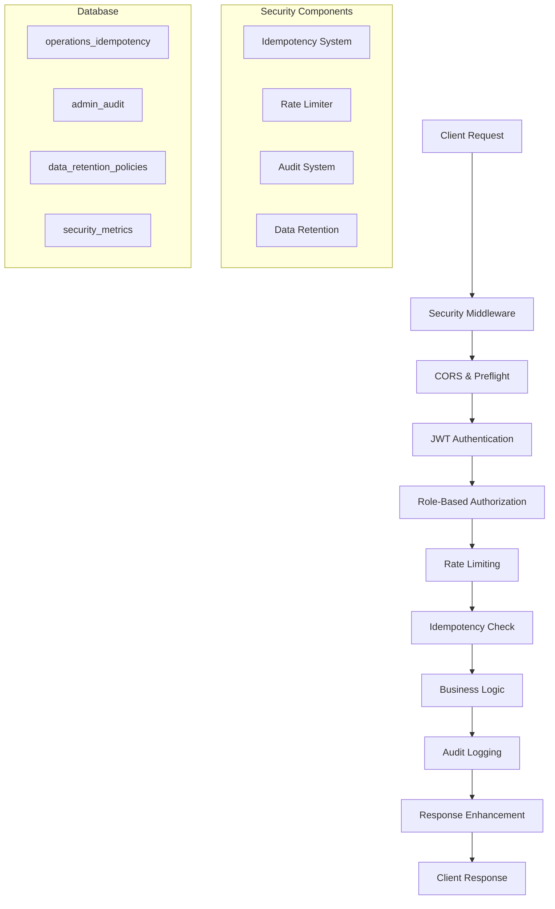

# Security & Compliance Hardening Documentation

## Overview

This document describes the comprehensive security and compliance hardening implemented for Schnittwerk Your Style. The system provides robust protection against common attacks, ensures idempotent operations, enforces rate limiting, maintains complete audit trails, and implements GDPR-compliant data retention.

## Architecture Overview



## Security Components

### 1. Unified Idempotency System

**Purpose**: Ensures repeated requests have no additional side effects, preventing duplicate operations.

**Features**:
- 24-hour TTL for idempotency keys by default
- SHA-256 request body hashing for exact match validation
- Support for all critical POST/PUT/PATCH operations
- Automatic cleanup of expired keys

**Usage**:
```typescript
import { withCriticalSecurity } from '../lib/security/middleware'

export const handler = withCriticalSecurity(async (event, context) => {
  // Your business logic here
  // Idempotency is automatically handled
}, {
  idempotency: { required: true }
})
```

**Client Implementation**:
```javascript
const idempotencyKey = `booking-${customerId}-${Date.now()}-${Math.random()}`

fetch('/api/booking/create', {
  method: 'POST',
  headers: {
    'X-Idempotency-Key': idempotencyKey,
    'Content-Type': 'application/json'
  },
  body: JSON.stringify(bookingData)
})
```

### 2. Granular Rate Limiting

**Purpose**: Protects against abuse with role-based and endpoint-specific limits.

**Configuration**:
- **Booking endpoints**: 10/min customers, 30/min staff, 100/min admin
- **Payment endpoints**: 10-20/min (admin/staff only)
- **Auth endpoints**: 5 per 15 minutes (brute force protection)
- **Default limits**: 60/min customers, 120/min staff, 300/min admin

**Features**:
- IP-based and user-based rate limiting
- Proper HTTP 429 responses with `Retry-After` headers
- Automatic cleanup of expired rate limit records
- Per-endpoint customization

**Headers in Response**:
```
X-RateLimit-Limit: 100
X-RateLimit-Remaining: 75
X-RateLimit-Reset: 1640995200
Retry-After: 60
```

### 3. Comprehensive Audit System

**Purpose**: Provides complete audit trail for compliance and security monitoring.

**Features**:
- Before/after data capture with diff tracking
- Admin action logging (settings, payments, deletions)
- Customer data access logging (GDPR compliance)
- Correlation ID tracking across requests
- IP address and user agent capture

**Audit Data Structure**:
```typescript
interface AuditLog {
  id: string
  actionType: string        // e.g., 'payment_refund', 'customer_delete'
  resourceType: string      // e.g., 'payment', 'customer', 'appointment'
  resourceId: string
  adminId: string
  adminEmail: string
  actionData: object        // Request metadata
  beforeData?: object       // State before change
  afterData?: object        // State after change
  diffData?: object         // Computed diff
  success: boolean
  ipAddress?: string
  userAgent?: string
  correlationId?: string
  createdAt: string
}
```

**Usage Examples**:
```typescript
// Automatic audit with middleware
export const handler = withAdminSecurity(async (event, context) => {
  // Changes automatically audited
}, {
  audit: {
    actionType: 'settings_update',
    resourceType: 'setting',
    captureRequest: true,
    captureResponse: true
  }
})

// Manual audit operations
await AuditOperations.customerDelete(context, customerId, customerData, reason)
await AuditOperations.paymentRefund(context, paymentId, amount, reason)
```

### 4. Data Retention & GDPR Compliance

**Purpose**: Automated data lifecycle management for legal compliance.

**Features**:
- Configurable retention policies per data type
- Dry-run mode with detailed preview
- Archive-before-delete option
- Rollback capability (24-hour window)
- Scheduled execution via Netlify functions

**Default Retention Policies**:
- Appointments: 7 years (completed/cancelled)
- Payments: 10 years (financial records)
- Audit logs: 7 years (compliance)
- Idempotency keys: 7 days (operational)
- Customer data: 7 years (inactive customers)

**Dry Run Example**:
```typescript
const retentionService = new DataRetentionService()
const dryRunResult = await retentionService.executeDryRun(policyId)

console.log({
  recordsToDelete: dryRunResult.resourceCount,
  oldestRecord: dryRunResult.oldestRecord,
  estimatedTime: dryRunResult.estimatedExecutionTime
})
```

## Security Middleware

### Enhanced Security Wrapper

The `withCriticalSecurity` function provides comprehensive protection for critical operations:

```typescript
export const handler = withCriticalSecurity(mainHandler, {
  requireAuth: true,
  allowedRoles: ['admin', 'staff', 'customer'],
  rateLimit: { 
    enabled: true,
    maxRequests: 50,
    windowMs: 60000
  },
  idempotency: { 
    enabled: true,
    required: true,
    ttlHours: 24
  },
  audit: { 
    enabled: true,
    actionType: 'booking_operation',
    resourceType: 'appointment',
    captureRequest: true
  }
})
```

### Security Context

Handlers receive an enhanced context with security features:

```typescript
interface SecurityContext {
  user: AuthenticatedUser
  correlationId: string
  logger: Logger
  startTime: number
  rateLimitHeaders?: Record<string, string>
}
```

## Database Schema

### New Security Tables

1. **operations_idempotency**: Unified idempotency tracking
2. **admin_audit** (enhanced): Audit logs with diff tracking
3. **data_retention_policies**: Retention configuration
4. **data_retention_executions**: Execution history
5. **security_metrics**: Security event tracking

### Migration

Apply the security schema migration:

```sql
-- Run the migration file
\i docs/db/19_security_compliance_hardening.sql
```

## Scheduled Jobs

### Data Retention Job

Configured to run daily via Netlify scheduled functions:

```typescript
// netlify/functions/data-retention-job.ts
// Runs daily at 2 AM UTC
// Environment variables:
// - NETLIFY_CRON_SECRET: Authentication
// - DATA_RETENTION_DRY_RUN: Set to 'false' for actual execution
```

### Configuration in netlify.toml

```toml
[[plugins]]
package = "@netlify/plugin-functions-install-core"

# Scheduled function configuration would go here
# (Implementation depends on Netlify's scheduling capabilities)
```

## Monitoring & Alerts

### Security Metrics

The system tracks key security metrics:

- Rate limit violations
- Idempotency cache hits
- Authentication failures
- Audit events
- Data retention operations

### Alert Conditions

Automatic alerts are triggered for:

- High rate limit violations (> 100/hour per IP)
- Failed authentication attempts (> 10/hour per IP)
- Large data retention operations (> 10,000 records)
- Failed scheduled jobs
- Security policy violations

## Testing

### Test Coverage

Comprehensive test suite covering:

- Idempotency: Repeated requests, key validation, caching
- Rate limiting: Limits enforcement, 429 responses, headers
- Audit: Trail completeness, diff tracking, compliance
- Data retention: Dry runs, execution, rollback

### Running Security Tests

```bash
npm run test -- src/test/security-compliance.test.ts
```

### End-to-End Security Validation

```bash
# Test idempotency
curl -X POST /api/booking/create \
  -H "X-Idempotency-Key: test-123" \
  -H "Content-Type: application/json" \
  -d '{"customer_id":"...", "service_id":"..."}'

# Repeat same request - should return cached response
curl -X POST /api/booking/create \
  -H "X-Idempotency-Key: test-123" \
  -H "Content-Type: application/json" \
  -d '{"customer_id":"...", "service_id":"..."}'

# Test rate limiting
for i in {1..20}; do
  curl -X POST /api/booking/create \
    -H "X-Idempotency-Key: test-$i" \
    -H "Content-Type: application/json" \
    -d '{"customer_id":"...", "service_id":"..."}'
done
```

## Security Best Practices

### For Developers

1. **Always use security middleware** for critical endpoints
2. **Validate idempotency keys** on the client side
3. **Handle 429 responses** with exponential backoff
4. **Never log sensitive data** in audit trails
5. **Use correlation IDs** for request tracing

### For Operations

1. **Monitor security metrics** daily
2. **Review audit logs** for suspicious activity
3. **Test data retention** with dry runs first
4. **Backup before** running retention jobs
5. **Keep rollback capability** for 24 hours

### Environment Variables

**Required**:
- `SUPABASE_URL`: Database connection
- `SUPABASE_SERVICE_ROLE_KEY`: Database service key
- `JWT_SECRET`: Token validation
- `NETLIFY_CRON_SECRET`: Scheduled job authentication

**Optional**:
- `DATA_RETENTION_DRY_RUN`: Set to 'false' for actual execution
- `SECURITY_ALERT_WEBHOOK`: Webhook for security alerts

## Compliance

### GDPR Compliance

- **Data minimization**: Only necessary data stored
- **Right to be forgotten**: Automated data deletion
- **Audit trails**: Complete access logging
- **Data portability**: Export capabilities
- **Consent tracking**: Payment method consent

### Security Standards

- **Idempotency**: RFC standards compliance
- **Rate limiting**: Industry best practices
- **Audit logging**: SOC 2 compliance ready
- **Data retention**: GDPR/CCPA compliant

## Troubleshooting

### Common Issues

1. **Idempotency key conflicts**: Check request body hash
2. **Rate limit false positives**: Verify IP detection
3. **Audit data missing**: Check middleware configuration
4. **Retention job failures**: Verify database permissions

### Debug Mode

Enable detailed logging:

```typescript
const logger = createLogger(correlationId)
logger.info('Debug message', { additionalData })
```

### Performance Considerations

- **Idempotency cleanup**: Runs every 24 hours
- **Rate limit cleanup**: Runs every hour
- **Audit data**: Consider archiving after 1 year
- **Metrics aggregation**: Daily rollups recommended

## Conclusion

The Security & Compliance Hardening system provides enterprise-grade protection for Schnittwerk Your Style, ensuring:

✅ **Idempotent Operations**: No duplicate side effects
✅ **Rate Limiting**: Protection against abuse
✅ **Complete Audit Trail**: Full compliance logging
✅ **Data Retention**: GDPR-compliant lifecycle management
✅ **Monitoring**: Comprehensive security metrics
✅ **Testing**: Full test coverage and validation

The system is designed for scalability, maintainability, and regulatory compliance, providing a solid foundation for secure operations.